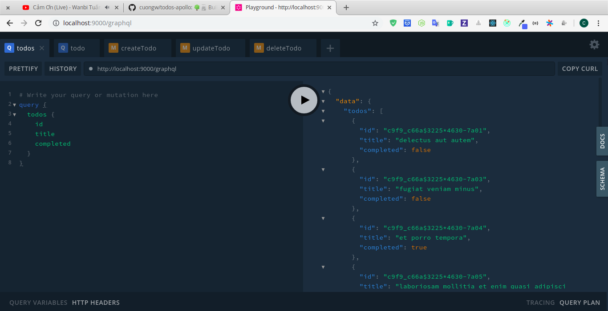
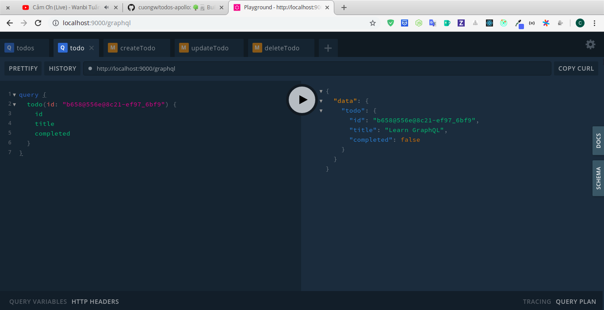
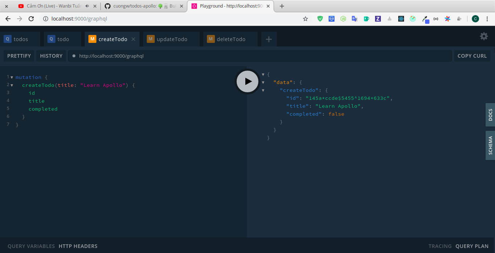
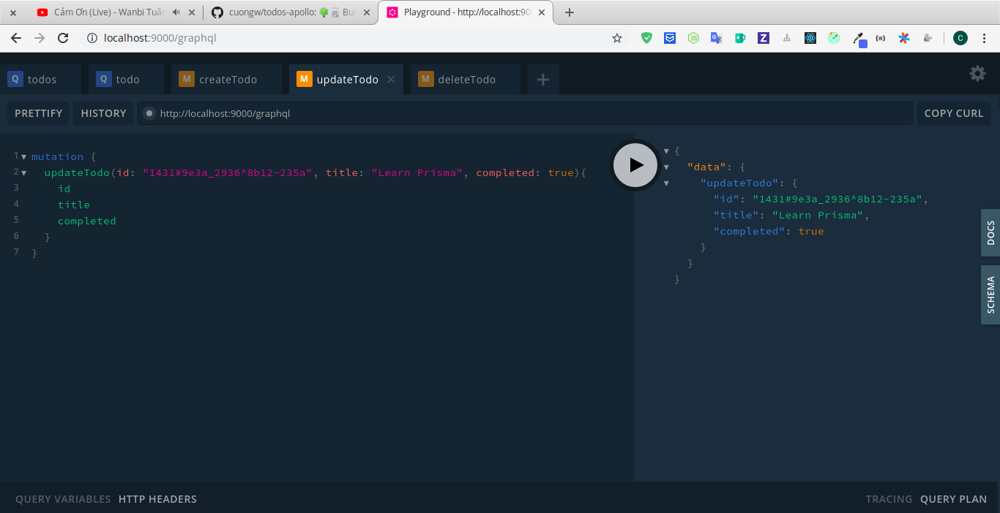
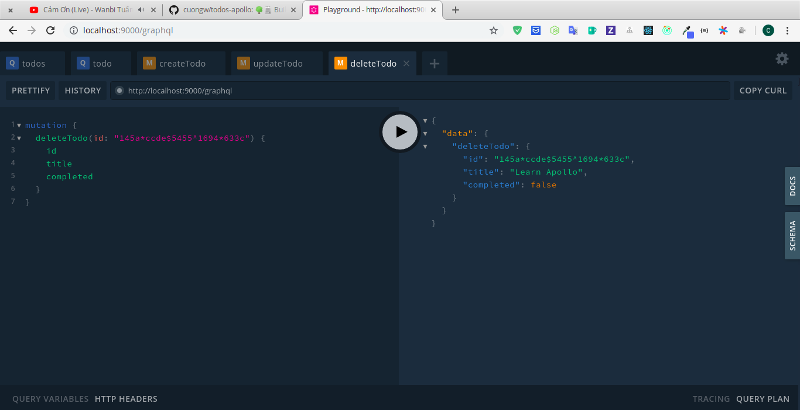

# todos-apollo

[](#contributors)

🌳🗒️ Building Todos app using Node, React, Apollo.

## Quick start

### Install dependencies

**For server**
```sh
$ cd server && yarn
```

**For client**
```sh
$ cd client && yarn
```

### Run this app

**For server**
```sh
$ cd server && yarn start
```

**For client**
```sh
$ cd client && yarn start
```

## API

### Queries

**todos: [Todo]**



```
query {
  todos {
    id
    title
    completed
  }
}
```

**todo(id: String!): Todo**



```
query {
  todo(id: "b658@556e@8c21-ef97_6bf9") {
    id
    title
    completed
  }
}
```

### Mutations

**createTodo(title: String): Todo**



```
mutation {
  createTodo(title: "Learn Apollo") {
    id
    title
    completed
  }
}
```

**updateTodo(id: String!, title: String, completed: Boolean): Todo**



```
mutation {
  updateTodo(id: "1431#9e3a_2936^8b12-235a", title: "Learn Prisma", completed: true){
    id
    title
    completed
  }
}
```

**deleteTodo(id: String!): Todo**



```
mutation {
  deleteTodo(id: "145a*ccde$5455^1694*633c") {
    id
  	title
    completed
  }
}
```

🙌 Awesome

## Contributors

Thanks goes to these wonderful people ([emoji key](https://allcontributors.org/docs/en/emoji-key)):

<!-- ALL-CONTRIBUTORS-LIST:START - Do not remove or modify this section -->
<!-- prettier-ignore -->
<table><tr><td align="center"><a href="http://cuongw.me"><br /><sub><b>Cuong Duy Nguyen</b></sub></a><br /><a href="https://github.com/cuongw/thinid/commits?author=cuongw" title="Code">💻</a> <a href="https://github.com/cuongw/thinid/commits?author=cuongw" title="Documentation">📖</a> <a href="https://github.com/cuongw/thinid/commits?author=cuongw" title="Tests">⚠️</a> <a href="#review-cuongw" title="Reviewed Pull Requests">👀</a></td></tr></table>

<!-- ALL-CONTRIBUTORS-LIST:END -->

This project follows the [all-contributors](https://github.com/all-contributors/all-contributors) specification. Contributions of any kind welcome!

## License

MIT © [cuongw](https://github.com/cuongw)
